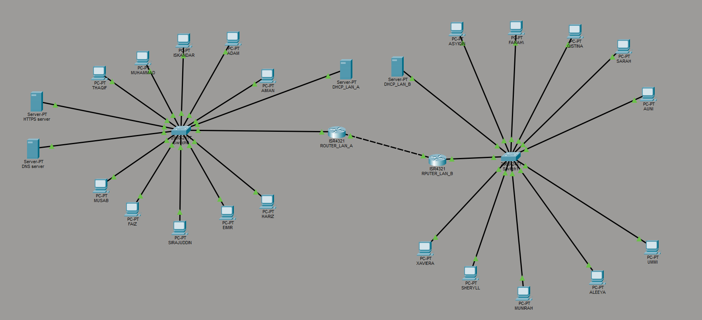

# Enterprise Network Design & Implementation

[](https://www.netacad.com/)
[](https://www.uitm.edu.my/)
[]()
[]()

An enterprise-grade multi-subnet network architecture designed, configured, and simulated in Cisco Packet Tracer. The infrastructure integrates dual-router static routing across separate local area networks (LAN A and LAN B), dynamic host configuration (DHCP), Domain Name System (DNS) resolution, and an internal HTTP enterprise web server hosting dedicated web assets.

---

## 📸 System Architecture & Visuals

### 1. Overall Network Topology
The complete dual-router enterprise network topology configured in Cisco Packet Tracer, interconnecting local subnets, switch infrastructure, and dedicated servers.



---

## 📸 Proof of Implementation & Services

### 2. Router Configuration & Inter-Subnet Routing
Static routing tables and IP interface parameters configured across central routers to allow full inter-subnet communication.

| Router 0 Configuration | Router 1 Configuration |
| :---: | :---: |
|  |  |

---

### 3. Dynamic Host Addressing (DHCP)
Dynamic host configuration pool deployment for end-user workstations across LAN A and LAN B.

| LAN A Client Configuration | LAN B Client Configuration |
| :---: | :---: |
|  |  |

---

### 4. Enterprise Web & DNS Hosting Services
Domain Name System (DNS) entry mappings and HTTP server rendering showing the custom enterprise web page (`index.html`) loaded from client workstations.

| DNS Server Record Setup | Enterprise HTTP Web Page |
| :---: | :---: |
|  |  |

---

### 5. Inter-Subnet Connectivity Verification
Packet delivery and network reachability verified through ICMP echo requests using direct IP addressing and domain name resolution.

| IP Address Ping Test | Domain Name Ping Test |
| :---: | :---: |
|  |  |

---

## 🛠️ Software & Tools Used

| Tool / Software | Role / Purpose |
| :--- | :--- |
| **Cisco Packet Tracer** | Primary network simulation environment for topology construction, device routing, dynamic services, and protocol analysis (`.pkt`). |
| **Visual Studio Code / Text Editor** | Authoring and structuring HTML site code (`index.html`) hosted on the embedded web server. |
| **Google Chrome / PDF Engine** | Documentation compilation and viewing (`.pdf`). |
| **Git & GitHub** | Source control, directory organization, and project hosting. |

---

## 🧮 Network Specification & Device Directory

| Subnet / Host | Device Name | Primary Interface / Service | Description / Function |
| :--- | :--- | :--- | :--- |
| **Gateway A** | Router 0 | FastEthernet / Serial | Default Gateway for LAN A & Static Routing Interface |
| **Gateway B** | Router 1 | FastEthernet / Serial | Default Gateway for LAN B & Static Routing Interface |
| **LAN A** | Client Workstations | FastEthernet (DHCP) | End-user devices receiving dynamic IPs |
| **LAN B** | Client Workstations | FastEthernet (DHCP) | End-user devices receiving dynamic IPs |
| **DNS Server** | DNS Server Host | Port 53 / Domain Mapping | Resolves custom corporate URL to Web Server IP |
| **Web Server** | Enterprise HTTP Server | Port 80 / HTTP Service | Hosts `index.html` and embedded assets (`uitm.png`, `Picture1.jpg`–`Picture3.jpg`) |

---

## ⚡ Key System Features

1. **Static Inter-Router Routing**: Configured static routing tables on Router 0 and Router 1 enabling end-to-end packet forwarding across distinct subnets.
2. **Dynamic Host Configuration Protocol (DHCP)**: Automated IP address, default gateway, and DNS server distribution to workstations, eliminating manual static IP configuration.
3. **Domain Name System (DNS)**: Provides domain name resolution so network clients can seamlessly access local web services via human-readable URLs.
4. **Custom HTTP Web Hosting**: Fully functional web server deployment storing custom HTML assets (`index.html`) and image elements (`uitm.png`, `Picture1.jpg`, `Picture2.jpg`, `Picture3.jpg`).
5. **Verified Subnet Reachability**: Complete end-to-end ICMP ping validation across subnets and across domain-resolved endpoints.

---

## 📄 Project Documentation

For comprehensive theoretical analysis, full IP addressing tables, CLI command logs, and network architecture documentation, refer to the included reports:

👉 **[Download Full Project Report (PDF)](./documentation/project-report.pdf)**
👉 **[Download Packet Tracer Portfolio (PDF)](./Portfolio%20of%20Cisco%20Packet%20Tracer.pdf)**

---

## 🚀 Installation & Simulation Setup

### Running in Cisco Packet Tracer
1. Clone this repository or download the project archive:
   ```bash
   git clone [https://github.com/your-username/enterprise-network-design.git](https://github.com/your-username/enterprise-network-design.git)